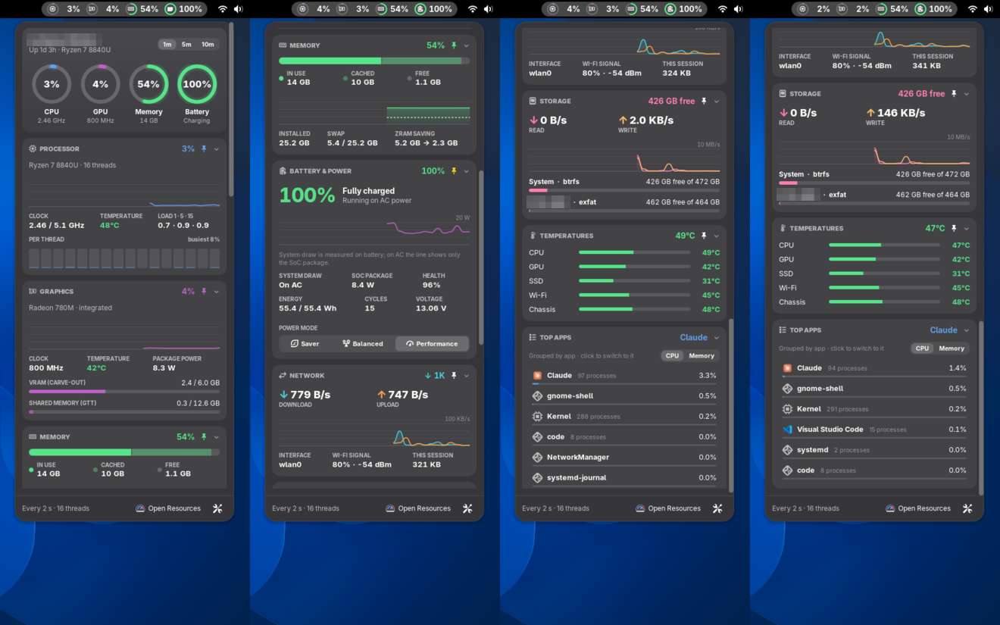
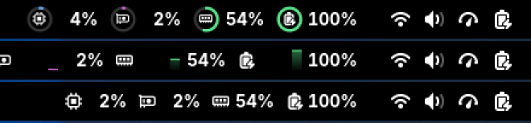

# TouchyStats

A system monitor for the GNOME top bar, and a companion to TouchyWeather. It puts CPU, GPU, memory and battery in the top bar as small rings, and clicking it opens a stack of cards with live graphs and the details behind each number.

I built it for my Minisforum V3 (Ryzen 7 8840U / Radeon 780M, CachyOS, GNOME 50), so that's where it's tested most. It should work on any recent GNOME with an AMD or Intel CPU. The GPU card needs AMD graphics.



## In the top bar

Pick any of CPU, GPU, memory, swap, CPU temperature, power draw, battery, network and disk, in whatever order you like. There are three styles:

- **Rings:** a small colored ring around a glyph, with the value beside it
- **Mini graphs:** the last minute as a tiny graph
- **Icons and numbers:** the plainest and narrowest option



## In the popover

- **Overview:** four large rings. Tap one to jump to its card. A 1m / 5m / 10m switch sets how much history every graph shows.
- **Processor:** load graph, clock speed, temperature, load average, and a bar for every thread.
- **Graphics:** load graph, clock, temperature, package power, and VRAM / shared memory (AMD only).
- **Memory:** in use / cached / free, a RAM and swap graph, and how much zram is saving.
- **Battery & Power:** charge, time left, a power-draw graph, health, cycles, the batteries of Bluetooth keyboards, mice and pens, and a Saver / Balanced / Performance switch.
- **Network and Storage:** up/down and read/write graphs, Wi-Fi signal, and free space per drive.
- **Temperatures:** every sensor worth naming (CPU, GPU, SSD, Wi-Fi, chassis).
- **Top apps:** the busiest apps by CPU or memory, with helper processes grouped under their app. Click one to switch to it.

Hover or touch a graph to read the exact value and how long ago it was. Click a card's header to collapse it, and use the pin to add or remove that metric in the top bar. The popover also scrolls with a finger drag, since I use the V3 as a tablet a lot.

## Light on the battery

I didn't want a monitor that costs more than it tells you, so I measured it:

- A background update takes about 0.5 ms. It runs every 2 s on AC and every 5 s on battery (both adjustable).
- Sensors that are slow to read (ACPI thermal zones, the NVMe temperature, the AC adapter) are only read while the popover is open, as are the process list and drive usage.
- Sampling pauses completely while the screen is locked or blanked. It never keeps the machine awake or blocks suspend.
- Keyboard, mouse and pen batteries come from UPower rather than sysfs. I learned this one the hard way: reading a Bluetooth keyboard's battery file makes the kernel ask the keyboard and wait for it, and a dozing keyboard can take two seconds to answer. Since extensions run on the Shell's main thread, the whole desktop froze while it waited.
- The top bar is only redrawn when a number or ring actually changes. Mini graphs are the exception, since they scroll every update.

## Install

```bash
git clone https://github.com/ClickCalickClick/TouchyStats-GNOME.git
cd TouchyStats-GNOME
./install.sh
```

Then log out and back in (Wayland only picks up new extensions at login), and turn TouchyStats on in the Extensions app if it isn't already. If you're hacking on it, `./install.sh --dev` symlinks the checkout instead, so your changes load on the next login.

Settings are under the gear in the popover, or in the Extensions app.

## Development

There's a headless test mode that doesn't need a logout. Run a throwaway Shell with `TS_DEV_SCREENSHOT_DIR` set, and it walks through the panel styles and the popover and saves screenshots:

```bash
XDG_CONFIG_HOME=/tmp/ts-cfg dbus-run-session -- bash -c '
  gsettings set org.gnome.shell enabled-extensions "[\"touchystats@clickcalickclick.github.io\"]"
  TS_DEV_SCREENSHOT_DIR=/tmp/ts-shots timeout 75 gnome-shell --headless --wayland --no-x11 --virtual-monitor 1400x1100'
```

The separate `XDG_CONFIG_HOME` keeps your real GNOME settings out of it.

### If the desktop stutters

`tools/lagprobe.py` is the read-only probe I wrote to track down that Bluetooth freeze. It pings the Shell over D-Bus every 25 ms, records what the Shell's main thread is doing whenever a reply is late (running, or asleep in the kernel and on what), and lines that up with memory, disk and CPU pressure, the GPU clock, the busiest processes and the journal:

```bash
python3 tools/lagprobe.py
```

Use the desktop as usual, press Enter in the terminal whenever something feels laggy, and press Ctrl+C for the report. It isn't specific to TouchyStats, so it works for hunting down any extension that blocks the Shell.

## License

GPL-2.0-or-later, the usual choice for GNOME Shell extensions. See [LICENSE](LICENSE).
